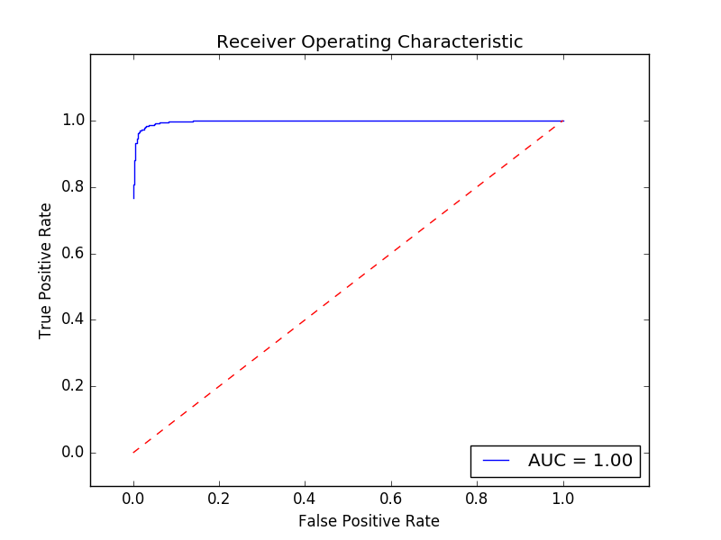
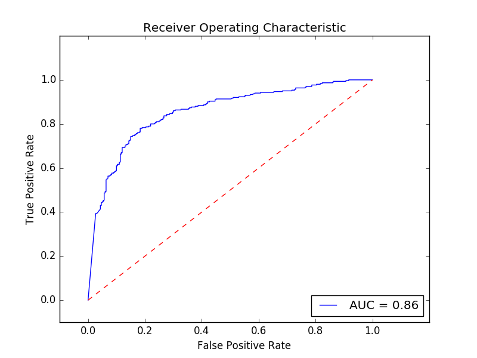

# Movie_review
## Problem Statement
I have solved the Problem Statement B<br>
Check this out on github [here](https://github.com/Anmol1696/Movie_review) or go to https://github.com/Anmol1696/Movie_review<br>

## Installing Libraries
The following python were used. In order to install just type `sudo pip install <library>`
+ pandas
* matplotlib
* numpy
* sklearn
* nltk

Other inbuilt python libraries are also used such as `sys`, `copy`, `random` etc.

One can run the below command to install all the dependencies
```
    sudo pip install pandas matplotlib numpy sklearn nltk
```

## Raw Data
The raw data with is in `movie_data/` (basically unziped version of the given zipped movie review).<br>
In this folder there are 2 more folders `neg/` and `pos/`. Each contain 1000 `.txt` files with negative and positive reviews respectively.
This data is from taken from [here](http://www.cs.cornell.edu/people/pabo/movie-review-data/)<br>

## Pandas DataFrame
The module `form_data` contains all the codes that deal with the pandas library. Now I will explaining about each script in this module

### init_data.py
This file contains functions that are used for converting the raw data in `movie_data/` into pandas dataframe.<br>
The function `main_form_data_frame` reads through the `movie_data/` then goes to `neg/` and `pos/` folders and read all the text files. This data is then converted into pandas data frame of the following format
```
    index(file_name) | raw_string | sentiment 
```
Where file_name of the `.txt` file is used as the index. There are 2 columns, first being the string form of the value of in the txt file i.e. all lines of the file concatinated into a single string. <br>
The `sentiment` column consists of the sentiment of the review i.e. basically which folder the txt file comes from `neg` for negative `pos` for positive<br>

Example of the raw data frame:
```
                                                                raw_string sentiment
    cv394_5137.txt   defending your life is an imaginative vision o...     pos
    cv460_10842.txt  deep rising is one of " those " movies . \nthe...     pos
    cv316_6370.txt   if he doesn=92t watch out , mel gibson is in d...     pos
    ....
```

When we run this module inorder to initialy form the `raw_data_frame` we run the following command
```
    python -m form_data.init_data <folder_name> <name_of_csv_file_for_storing_dataframe>
```
where `<folder_name>` is the location where the unziped data is kept. For our case it is `movie_data/`<br>
The second parameter `<name_of_csv_file_for_storing_dataframe>` is the location where one wants to store the data frame in csv format. We store all the `csv` file in folder `form_data/dataframe/`. This is file that will be formed<br>

For obtaining `raw_review.csv` we run the following command
```
    python -m form_data.init_data movie_data/ form_data/dataframe/raw_review.csv
    
    #NOTE
    Time taken ~ 8 secs for the complete data set
```

### pandas_functions.py
This file contains functions that are used to form a `sentiment_data_frame` data frame. This data set contains 2 columns. The value in the columns are the file names for either `neg` or `pos` column.<br>
The dataframe is something like
```
                     neg              pos
    0    cv077_23172.txt   cv394_5137.txt
    1    cv981_16679.txt  cv460_10842.txt
    2    cv619_13677.txt   cv316_6370.txt
    ....

    #Note there is no index for this data frame
```
The use of the dataframe is so that we can get all the filenames correspoding to a sentiment. This is used furted down the line inorder to extract some more information<br>
This module also has a function `read_pandas_raw_csv` which is used extensively through out the code. This basically converts csv file to pandas dataframe with appopriate headers and labels<br>

The command that is run is
```
    python -m form_data.pandas_functions form_data/dataframe/raw_review.csv form_data/dataframe/sentiment_filenames.csv
```

Another funtion in this module is `form_processed_word_frequency_data_frame`. This function is used to form a dataframe from a given dict of the form
```
    {'neg' : {word : frequency,..}, 'pos' : {word:frequency,..}}
```
<br>
Both the above stated functions `read_pandas_raw_csv` and `form_processed_word_frequency_data_frame` are not used in this particular file but these are imported by other modules<br>

### form_train_test.py
This is the code that is run inorder to form the training and the testing set from the `raw_reviews.csv` file or data frame<br>
Let us say we want a training 70% testing 30% of the data.(code is hard coded for this %). Let the total size be N.<br> 
First the `sentiment_filnames.csv` is read and converted to a dataframe. From here we choose randomly with seed.
`N*0.7*0.5` data are choosen from filenames with `pos` sentiment, rest with `neg` statement <b>ensuring that there is equal representation of the positive and negative cases</b> <br>

Now the testing and the training raw files are kept in the `form_data/dataframe/test/` and `form_data/dataframe/test/` folders. Later other files will be added here.<br>
Command for forming testing and training data
```
    [Format]
    python -m form_data.form_train_test <raw_review_csv_file> <sentiment_filenames_csv> <raw_train_csv_storage_location> <raw_test_csv_storage_location> <random_seed>
    
    [Command that I ran]
    python -m form_data.form_train_test form_data/dataframe/raw_review.csv form_data/dataframe/sentiment_filenames.csv form_data/dataframe/train/raw_train.csv form_data/dataframe/test/raw_test.csv 15

    #[NOTE]
    Time taken to run the above command is 2 sec
```

Note that the random seed that used is `15`. One can use another seed to obtain a different set of training and testing data


## Pre Processing
This consists of all the code needed to preprocess the `raw_string`
## processing_functions.py
A script that reads the `raw_review.csv` file or corresponding data frame `raw_data_frame` and forms 2 new data frames namely `frequency_data_frame` and `processed_data_frame`<br>
First in the `raw_data_frame`'s `raw_string` we perform following functions
* convert the whole string in lower case
+ remove any non ascii charecter, i.e. this will only contain charecters from `a to z` and space
+ if a single word lenght is less than 1 then ignore it
+ stem all the words using `nltk.stem.snowball.EnglishStemmer`

Now we form a copy of the `raw_data_frame`, append a column of preprocessed string and remove the column of raw string. This data frame is then called `processed_data_frame` and writen to appopriate csv file.<br>
 So the `processed_data_frame` is of the format
 ```
    index(file_names) | sentiment | processed_string
 ```

Another data frame is formed `frequency_data_frame`. This data frame stores the frequency of each word occuring in files with negative sentiment as well as possitive<br>
The format of this is like
```
    index(words) |  neg         |   pos
    word1           frequency1      frequency2
    ...
    ...

    where frequency1 is number of times word1 occured in file with negative sentiment
    frequency2 is number of times word1 occured in file with positive sentiment
```

The command that is required to run this is
```
    [Format]
    python -m pre_process.processing_functions <raw_review_csv_locaiton> <processed_test_csv_location> <frequency_test_csv_location>

    [Command I ran]
    python -m pre_process.processing_functions form_data/dataframe/train/raw_train.csv form_data/dataframe/train/processed_train.csv form_data/dataframe/train/frequency_train.csv

    [Note]
    Time taken to run this command
        for training data -> 4 min 36 secs
        for testing data  -> 1 min 28 secs
```
Note one has to preprocess both training as well as the testing data. So the same command is run of the testing folder as well<br>

## Classification
For classification I used the `sklearn` library. Naive Bayes is implemented here however one can implement anyother classifier as well without changing the rest of the code<br>
### naviebayes_classification.py
Script that used the `sklearn` implementation on our data to classify it.<br>
Now since we have the training data which is preprocessed, we load the `processed_words` and the `sentiment` columns in the `sklearn.naive_bayes.MultinomialNB` function that performs multinomial navie bayes. We then end up with a classifier<br>
Then we load the testing data's `processed_words` into the classifier and obtain the predictions<br>
These predictions are then appended to the testing data frame as `prediction_nb` column.<br>
Now the testing data frame is of the form
```
    index(word) | sentiment | processed_words | prediction_nb
```
Then the testing data frame is writen back, if the writing boolean `write_back_to_file` is set to True, to `processed_test.csv`, which was the original testing data framw csv file without the new column<br>

The command that is used to run this is
```
    [Format]
    python -m classification.naviebayes_classification <training_data_csv> <testing_data_csv> <write_back_to_file>

    [Command that I ran]
    python -m classification.naviebayes_classification form_data/dataframe/train/processed_train.csv form_data/dataframe/test/processed_test.csv True

    [Note]
    Time taken to run -> 2 sec approx for both cases i.e. testing_data = testing_data and testing_data = training_data
```

####Crossvalidation
For this the testing data is same as the training data. So in the above command just make `<training_data_csv>` same as `<testing_data_csv>`<br>

Apart from these the script also forms the `confusion_matrix` as well as the `roc_curve` This is discuss this in the Result section<br>

## Results
When we run the classifier we get also find out the Confusion matrix and the ROC curve. For the `random_seed = 15` I obtain a particular set of testing and traing data. The results are for that set.<br>

### Confusion Matrix
For the cross validation set I obtain the confusion matrix to be
```
        pos | neg
    pos 674   26
    neg 9     691
```
When the testing set is the actual testing set we obtain the following matrix
```
        pos | neg
    pos 229   71
    neg 55    245
```

### ROC curve
The roc curve obtained from crossvalidation<br>

For this curve we get `AUC = 1`<br>

The ROC curve for testing set<br>


